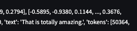

<!-- Improved compatibility of back to top link: See: https://github.com/othneildrew/Best-README-Template/pull/73 -->
<a name="readme-top"></a>
<!--
*** Thanks for checking out the Best-README-Template. If you have a suggestion
*** that would make this better, please fork the repo and create a pull request
*** or simply open an issue with the tag "enhancement".
*** Don't forget to give the project a star!
*** Thanks again! Now go create something AMAZING! :D
-->


<!-- PROJECT SHIELDS -->
<!--
*** I'm using markdown "reference style" links for readability.
*** Reference links are enclosed in brackets [ ] instead of parentheses ( ).
*** See the bottom of this document for the declaration of the reference variables
*** for contributors-url, forks-url, etc. This is an optional, concise syntax you may use.
*** https://www.markdownguide.org/basic-syntax/#reference-style-links
-->


<!-- PROJECT LOGO -->
<br />
<div align="center">
  <a href="https://github.com/github_username/repo_name">
    
  </a>

<h3 align="center">Audio Translate Demo</h3>

  <p align="center">
 ·
    <a href="https://audio.nyctaxi.me/">View Live Demo</a>
    ·
    <a href="https://github.com/willgroves/AudioTranslateDemo/issues">Report Bug</a>
    ·
    <a href="https://github.com/willgroves/AudioTranslateDemo/issues">Request Feature</a>
·
  </p>
</div>

<!-- ABOUT THE PROJECT -->
## About The Project

* AudioTranslateDemo is a demo of the [OpenAI Whisper](https://github.com/openai/whisper) transcription and translation model released and discussed in [this paper](https://cdn.openai.com/papers/whisper.pdf). It is a simple web frontend that allows you to upload an audio file and translate it to text. The text is then translated to another language and spoken back to you.
<p align="right">(<a href="#readme-top">back to top</a>)</p>

<!-- GETTING STARTED -->
## Motivation

This repository demonstrates deployment of a Streamlit application to the Google Cloud Platform. In particular, it exercises several features:
* [OpenAI Whisper]() transcription and translation model in a single deep learning model (unlike the traditional two phase system of Automatic Speech Recognition and Translation)
* [Cloud Run](https://cloud.google.com/run) for hosting the application in a way that can facilitate scale to zero (no resources are consumed if the service is not being actively used)
* [Streamlit](https://streamlit.io/) for the web frontend
* [Docker](https://www.docker.com/) for containerization
* [Google Cloud Build](https://cloud.google.com/build) for building the container and deploying to Cloud Run
* [Google Cloud Artifact Registry](https://cloud.google.com/artifact-registry) for storing the container image

## Getting Started

To try things out, you can use the live demo at https://audio.nyctaxi.me/. If deploying another instance is the goal, then read on.


### Build and Deploy

1. Build the Docker container locally
```sh 
bash container_build.sh
```
2. Test the container locally
```shell
docker run -p 8080:8080 -it us-east1-docker.pkg.dev/gcloudsdk-on-wmm/gdocker/audiotranslatedemo:v20221121a
```
Then browse to http://localhost:8080/ to see the Streamlit application running locally.

4. Upload the container to Google Artifact Registry
```shell
UPLOAD=1 bash container_build.sh
```
5. Determine the DNS names of the frontend server for your deployment

6. Instantiate and configure the container in Google Cloud Run on the Google Cloud console.

<p align="right">(<a href="#readme-top">back to top</a>)</p>

<!-- USAGE EXAMPLES -->
## Usage

To interact with the deployed demo system, browse to https://audio.nyctaxi.me/.

<p align="right">(<a href="#readme-top">back to top</a>)</p>


<!-- ROADMAP -->
## Roadmap

- [ ] Make the demo look nicer in streamlit

See the [open issues](https://github.com/willgroves/audiotranslateui/issues) for a full list of proposed features (and known issues).

<p align="right">(<a href="#readme-top">back to top</a>)</p>


<!-- CONTRIBUTING -->
## Contributing

Contributions are what make the open source community such an amazing place to learn, inspire, and create. Any contributions you make are **greatly appreciated**.

If you have a suggestion that would make this better, please fork the repo and create a pull request. You can also simply open an issue with the tag "enhancement".
Don't forget to give the project a star! Thanks again!

1. Fork the Project
2. Create your Feature Branch (`git checkout -b feature/AmazingFeature`)
3. Commit your Changes (`git commit -m 'Add some AmazingFeature'`)
4. Push to the Branch (`git push origin feature/AmazingFeature`)
5. Open a Pull Request

<p align="right">(<a href="#readme-top">back to top</a>)</p>


<!-- LICENSE -->
## License

Distributed under the MIT License. See `LICENSE.txt` for more information.

<p align="right">(<a href="#readme-top">back to top</a>)</p>


<!-- CONTACT -->
## Contact

William Groves - [@willgrovesemail](https://twitter.com/willgrovesemail)

Project Link: [https://github.com/willgroves/audiotranslatedemo](https://github.com/willgroves/audiotranslatedemo)

<p align="right">(<a href="#readme-top">back to top</a>)</p>

## Acknowledgments
* A great template: [Best-README-Template](https://github.com/othneildrew/Best-README-Template)

<!-- MARKDOWN LINKS & IMAGES -->
<!-- https://www.markdownguide.org/basic-syntax/#reference-style-links -->
[contributors-shield]: https://img.shields.io/github/contributors/github_username/repo_name.svg?style=for-the-badge
[contributors-url]: https://github.com/github_username/repo_name/graphs/contributors
[forks-shield]: https://img.shields.io/github/forks/github_username/repo_name.svg?style=for-the-badge
[forks-url]: https://github.com/github_username/repo_name/network/members
[stars-shield]: https://img.shields.io/github/stars/github_username/repo_name.svg?style=for-the-badge
[stars-url]: https://github.com/github_username/repo_name/stargazers
[issues-shield]: https://img.shields.io/github/issues/github_username/repo_name.svg?style=for-the-badge
[issues-url]: https://github.com/github_username/repo_name/issues
[license-shield]: https://img.shields.io/github/license/github_username/repo_name.svg?style=for-the-badge
[license-url]: https://github.com/github_username/repo_name/blob/master/LICENSE.txt
[linkedin-shield]: https://img.shields.io/badge/-LinkedIn-black.svg?style=for-the-badge&logo=linkedin&colorB=555
[linkedin-url]: https://linkedin.com/in/linkedin_username
[product-screenshot]: images/screenshot.png
[Next.js]: https://img.shields.io/badge/next.js-000000?style=for-the-badge&logo=nextdotjs&logoColor=white
[Next-url]: https://nextjs.org/
[React.js]: https://img.shields.io/badge/React-20232A?style=for-the-badge&logo=react&logoColor=61DAFB
[React-url]: https://reactjs.org/
[Vue.js]: https://img.shields.io/badge/Vue.js-35495E?style=for-the-badge&logo=vuedotjs&logoColor=4FC08D
[Vue-url]: https://vuejs.org/
[Angular.io]: https://img.shields.io/badge/Angular-DD0031?style=for-the-badge&logo=angular&logoColor=white
[Angular-url]: https://angular.io/
[Svelte.dev]: https://img.shields.io/badge/Svelte-4A4A55?style=for-the-badge&logo=svelte&logoColor=FF3E00
[Svelte-url]: https://svelte.dev/
[Laravel.com]: https://img.shields.io/badge/Laravel-FF2D20?style=for-the-badge&logo=laravel&logoColor=white
[Laravel-url]: https://laravel.com
[Bootstrap.com]: https://img.shields.io/badge/Bootstrap-563D7C?style=for-the-badge&logo=bootstrap&logoColor=white
[Bootstrap-url]: https://getbootstrap.com
[JQuery.com]: https://img.shields.io/badge/jQuery-0769AD?style=for-the-badge&logo=jquery&logoColor=white
[JQuery-url]: https://jquery.com 

prereq:
 8834  whisper audio/will.m4a --language en
 8835  whisper audio/will.m4a --language zh-
 8836  whisper audio/will.m4a --language zh
 8837  whisper audio/will.m4a --language zh --task translate
 8882  pip install git+https://github.com/openai/whisper.git

can also use whisper from the command line


run stuff:

streamlit run AudioTranslateUI.py

